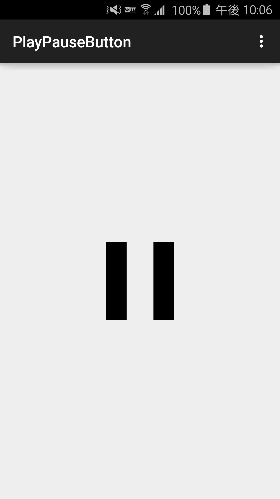

# PlayPauseButton
[](https://github.com/recruit-lifestyle/PlayPauseButton)

The View makes Animation the state of play.  
Even if this works fine with API.13 or less, we support only for API.14 or more.  

##Screenshots
*Watch YouTube video [here](https://www.youtube.com/watch?v=p9mtTcH2gAo&feature=youtu.be).*




## Requirements
Target Sdk Version : 21  
Min Sdk Version : 14  

##How to use
1) Add this to your **build.gradle**.
```java
repositories {
    maven {
        url "https://jitpack.io"
    }
}

dependencies {
  compile 'com.github.recruit-lifestyle:PlayPauseButton:1.0'
}
```  

2) Add ```java jp.co.recruit_lifestyle.android.widget.PlayPauseButton```  to your layout XML file.
```xml
<RelativeLayout xmlns:android="http://schemas.android.com/apk/res/android"
    xmlns:tools="http://schemas.android.com/tools"
    android:layout_width="match_parent"
    android:layout_height="match_parent"
    >

    <jp.co.recruit_lifestyle.android.widget.PlayPauseButton
        android:layout_width="100dp"
        android:layout_height="100dp"
        android:layout_centerInParent="true"
        android:id="@+id/main_play_pause_button"
        />

</RelativeLayout>
```  

3) Add ```PlayPauseButton.OnControlStatusChangeListener```  
```java
playPauseButton.setOnControlStateChangeListener(new PlayPauseButton.OnControlStatusChangeListener() {
  @Override public void onStatusChange(View view, boolean state) {
    if(state) {
      mMediaPlayer.start();
    } else {
      mMediaPlayer.pause();
    }
  }
});
```

## Credits

WaveSwipeRefresh is owned and maintained by [RECRUIT LIFESTYLE CO., LTD.](http://www.recruit-lifestyle.co.jp/)

WaveSwipeRefresh was originally created by [Yuki Mima](https://github.com/amyu)  


##License

    Copyright 2015 RECRUIT LIFESTYLE CO., LTD.

    Licensed under the Apache License, Version 2.0 (the "License");
    you may not use this file except in compliance with the License.
    You may obtain a copy of the License at

       http://www.apache.org/licenses/LICENSE-2.0

    Unless required by applicable law or agreed to in writing, software
    distributed under the License is distributed on an "AS IS" BASIS,
    WITHOUT WARRANTIES OR CONDITIONS OF ANY KIND, either express or implied.
    See the License for the specific language governing permissions and
    limitations under the License.
